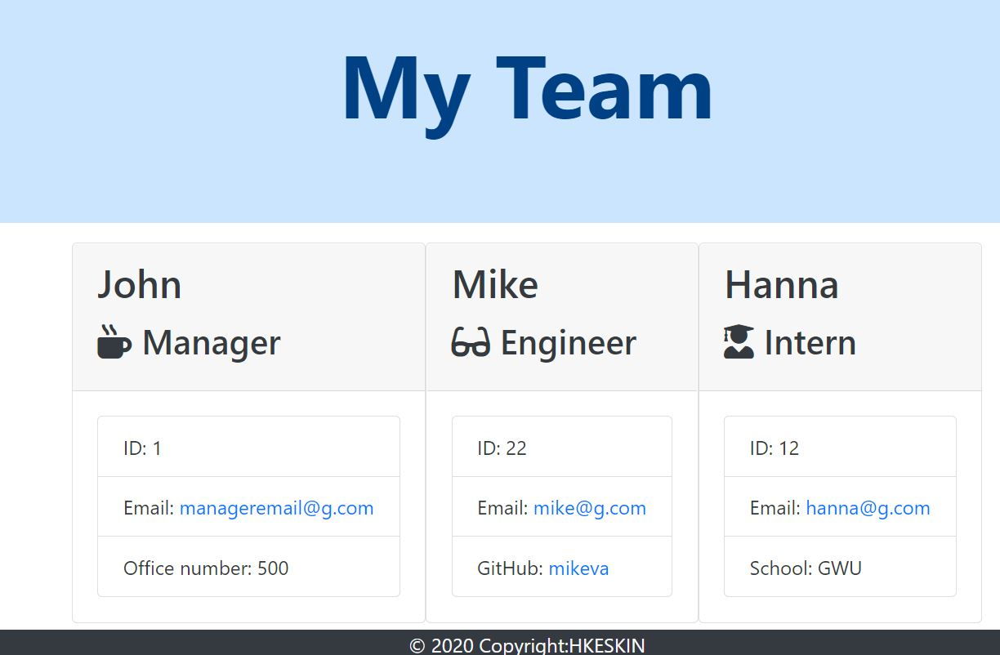
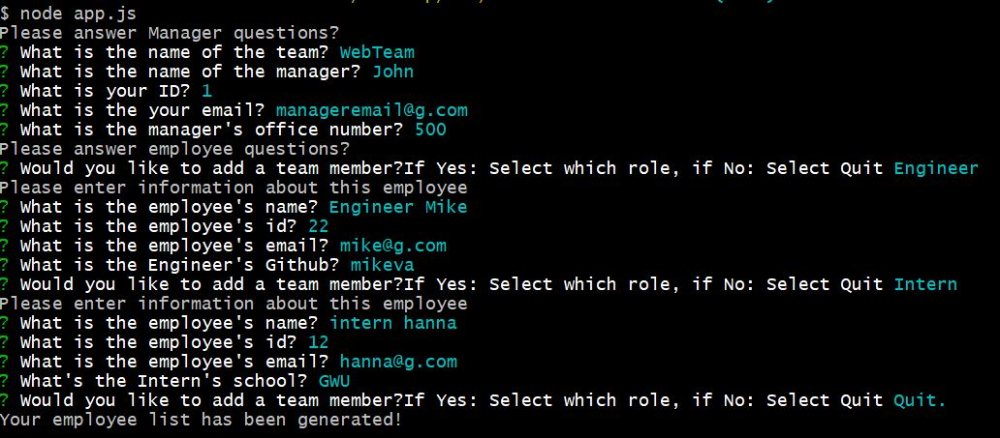
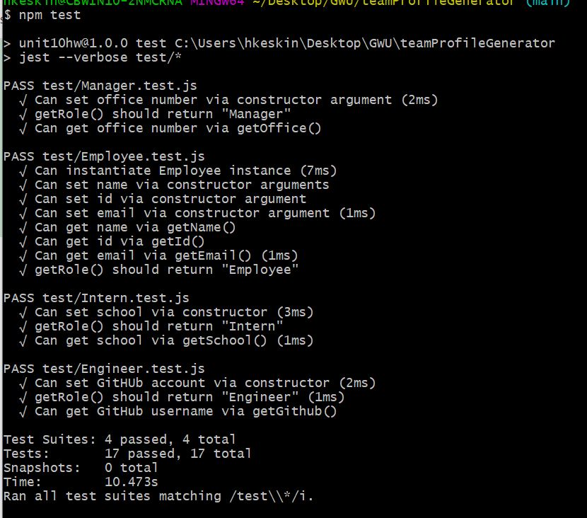

# Team Profile Generator

## Description

This app is to build a Node CLI that takes in information about employees and generates an HTML webpage that displays summaries for each person. 
The application will prompt the user for information about the team manager and then information about the team members. The user can input any number of team members, and they may be a mix of engineers and interns.When the user has completed building the team, the application will create an HTML file that displays a nicely formatted team roster based on the information provided by the user. Following the [common templates for user stories](https://en.wikipedia.org/wiki/User_story#Common_templates), we can frame this challenge as follows:

## Technologies

* [Inquirer npm package](https://github.com/SBoudrias/Inquirer.js/) to prompt the user for their email, id, and specific information based on their role with the company.

* Below is an example of the application screenshot




The dependencies are, [jest](https://jestjs.io/) for running the provided tests, and [inquirer](https://www.npmjs.com/package/inquirer) for collecting input from the user.

### User input

The project prompts the user to build an engineering team. An engineering
team consists of a manager, and any number of engineers and interns.

### Roster output

The project  generates a `team.html` page in the `output` directory, that displays a nicely formatted team roster. Each team member displays the following in no particular order:

  * Name
  * Role
  * ID
  * Role-specific property (School-Intern, link to GitHub profile-Engineer, or office number-Manager)

## Table of Contents

* Title

* Description

* Technologies

* User input

* Roster output

* Table of Contents

* Installation

* Usage

* Test

* Contributers

* Questions

* Urls

* Video

## Installation

```md
npm init
npm install 
```

## Usage

```md
node app.js
```
## Test

```md
🎗 Remember, you can run the tests at any time with `npm run test`
```

## Contributers

*  [H Keskin](https://github.com/kinziva)

## Questions
Contact with me with any questions : [GitHub](https://github.com/kinziva)<br />

## Urls
* Repository [Repository URL ](https://github.com/kinziva/teamProfileGenerator)

## Video
 Click to Watch! Video Walktrough [![https://youtu.be/MrEuEnu8QFM ]](https://youtu.be/MrEuEnu8QFM "Team Engine - Employee Summary Generator usage definition!") Explained following in the Video.
* How to install the app
* How to run the app
* How to enter responses for the app 
* Generated team.html in browser preview

 Test Video[![https://youtu.be/G596L634vFc ]](https://youtu.be/G596L634vFc "Tests usage definition!") Explained following in the Video.

* How to run the tests
* View Test Result